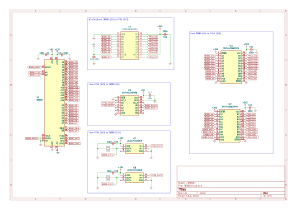
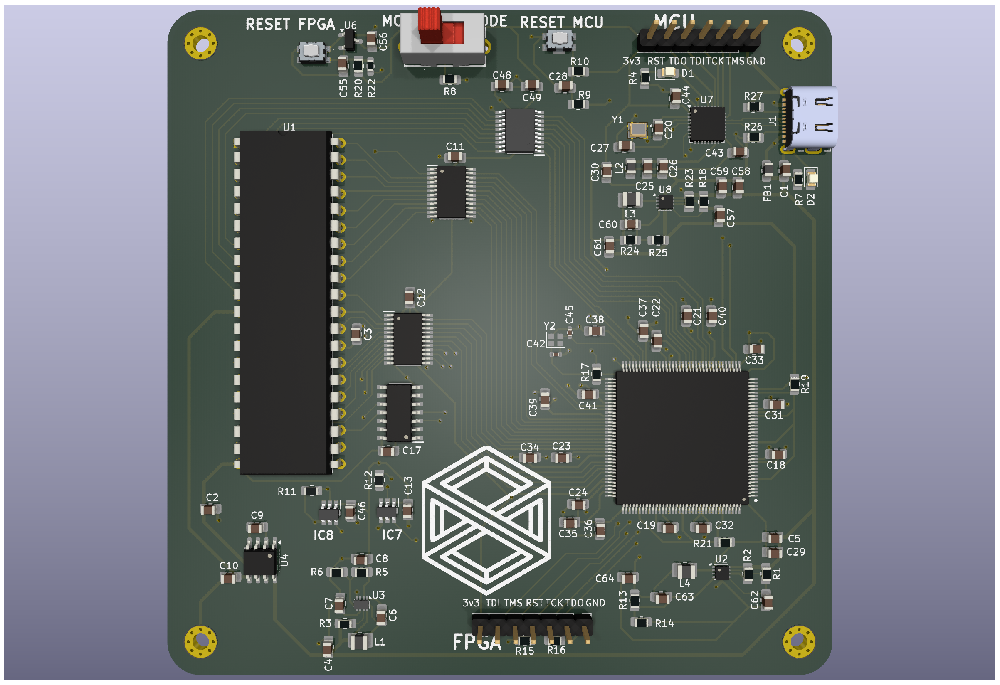
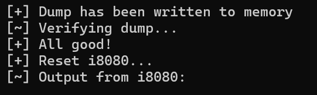

# System board for Intel 8080
FPGA-based single board computer to run Intel 8080 CPU (up to 3.125Mhz)

## Board

Full schematics in [pdf format](./pcb/schematic.pdf)

Here is shown only main part of the board:


Archive with gerber files and drill locations could be found [here](./pcb/manufacturing.zip)



Bill of material in [CSV format](./pcb/bom.csv)

|Reference                                                                                                                           |Value               |Footprint                                                 |Mouser Part Number  |Qty|
|------------------------------------------------------------------------------------------------------------------------------------|--------------------|----------------------------------------------------------|--------------------|---|
|C1,C7,C25,C57,C62                                                                                                                   |1u                  |Capacitor_SMD:C_0805_2012Metric_Pad1.18x1.45mm_HandSolder |187-CL21B105KAFNNNG |5  |
|C2,C3,C6,C11,C12,C13,C17,C18,C19,C21,C22,C23,C24,C26,C28,C29,C31,C32,C33,C34,C35,C36,C37,C38,C39,C40,C41,C43,C44,C46,C48,C49,C56,C58|100n                |Capacitor_SMD:C_0805_2012Metric_Pad1.18x1.45mm_HandSolder |187-CL21B104KBCNNND |34 |
|C4,C30                                                                                                                              |4u7,4u7, low-ESR    |Capacitor_SMD:C_0805_2012Metric_Pad1.18x1.45mm_HandSolder |187-CL21A475KAQNNNE |2  |
|C5,C59,C61,C64                                                                                                                      |22u                 |Capacitor_SMD:C_0805_2012Metric_Pad1.18x1.45mm_HandSolder |187-CL21A226MAYNNNE |4  |
|C8,C9,C10,C55                                                                                                                       |10u,10u, low-ESR    |Capacitor_SMD:C_0805_2012Metric_Pad1.18x1.45mm_HandSolder |187-CL21A106KAYNNNF |4  |
|C20,C27                                                                                                                             |10p                 |Capacitor_SMD:C_0805_2012Metric_Pad1.18x1.45mm_HandSolder |710-885012007051    |2  |
|C42,C45                                                                                                                             |10p                 |Capacitor_SMD:C_0402_1005Metric_Pad0.74x0.62mm_HandSolder |603-CC402JRNPO8BN100|2  |
|C60                                                                                                                                 |33p                 |Capacitor_SMD:C_0805_2012Metric_Pad1.18x1.45mm_HandSolder |710-885012007031    |1  |
|C63                                                                                                                                 |22p                 |Capacitor_SMD:C_0805_2012Metric_Pad1.18x1.45mm_HandSolder |710-885012007053    |1  |
|D1                                                                                                                                  |Red                 |LED_SMD:LED_0805_2012Metric_Pad1.15x1.40mm_HandSolder     |710-150080RS75000   |1  |
|D2                                                                                                                                  |Green               |LED_SMD:LED_0805_2012Metric_Pad1.15x1.40mm_HandSolder     |710-150080GS75000   |1  |
|FB1                                                                                                                                 |Ferrite_Bead        |Inductor_SMD:L_0805_2012Metric_Pad1.15x1.40mm_HandSolder  |652-MG2029-101Y     |1  |
|H1,H2,H3,H4                                                                                                                         |2.5mm               |MountingHole:MountingHole_2.5mm_Pad_Via                   |                    |4  |
|IC1,IC2                                                                                                                             |SN74LVC861APW       |Project components:SOP65P640X120-24N                      |595-SN74LVC861APW   |2  |
|IC5                                                                                                                                 |CD74HC243M96        |Project components:SOIC127P600X175-14N                    |595-CD74HC243M96    |1  |
|IC6                                                                                                                                 |M2GL005-TQG144I     |Project components:QFP50P2200X2200X160-144N               |494-M2GL005-TQG144I |1  |
|IC7,IC8                                                                                                                             |UCC27511DBVR        |SOT95P280X145-6N                                          |595-UCC27511DBVR    |2  |
|IC9                                                                                                                                 |TXS0108EPWRG4       |Project components:SOP65P640X120-20N                      |595-TXS0108EPWRG4   |1  |
|J1                                                                                                                                  |Type-C              |Connector_USB:USB_C_Receptacle_JAE_DX07S016JA1R1500       |656-DX07S016JA1R1500|1  |
|J2,J4                                                                                                                               |FPGA JTAG,MCU JTAG  |Connector_PinHeader_2.54mm:PinHeader_1x07_P2.54mm_Vertical|649-1012937990701BLF|2  |
|L1                                                                                                                                  |8u2, 800mA          |Inductor_SMD:L_1008_2520Metric_Pad1.43x2.20mm_HandSolder  |81-DFE252012F-8R2MP2|1  |
|L2                                                                                                                                  |27n                 |Inductor_SMD:L_0805_2012Metric_Pad1.15x1.40mm_HandSolder  |652-CE201210-27NJ   |1  |
|L3,L4                                                                                                                               |0u68, 5.5A          |Inductor_SMD:L_1008_2520Metric_Pad1.43x2.20mm_HandSolder  |652-SRP2512-R68M    |2  |
|R1,R18                                                                                                                              |10                  |Resistor_SMD:R_0805_2012Metric_Pad1.20x1.40mm_HandSolder  |603-RT0805DRE0710RL |2  |
|R2,R13,R14,R23                                                                                                                      |100k                |Resistor_SMD:R_0805_2012Metric_Pad1.20x1.40mm_HandSolder  |603-RT0805DRE07100KL|4  |
|R3,R6                                                                                                                               |30k                 |Resistor_SMD:R_0805_2012Metric_Pad1.20x1.40mm_HandSolder  |603-RT0805DRE0730KL |2  |
|R4                                                                                                                                  |4k7                 |Resistor_SMD:R_0805_2012Metric_Pad1.20x1.40mm_HandSolder  |603-RT0805FRE134K7L |1  |
|R5                                                                                                                                  |330k                |Resistor_SMD:R_0805_2012Metric_Pad1.20x1.40mm_HandSolder  |603-RT0805FRE07330KL|1  |
|R7                                                                                                                                  |2k2                 |Resistor_SMD:R_0805_2012Metric_Pad1.20x1.40mm_HandSolder  |603-RT0805FRE072K2L |1  |
|R8,R10,R19,R20,R21                                                                                                                  |10k                 |Resistor_SMD:R_0805_2012Metric_Pad1.20x1.40mm_HandSolder  |603-RT0805DRD0710KL |5  |
|R9,R11,R12                                                                                                                          |220                 |Resistor_SMD:R_0805_2012Metric_Pad1.20x1.40mm_HandSolder  |603-RT0805FRE07220RL|3  |
|R15,R16,R17                                                                                                                         |1k                  |Resistor_SMD:R_0805_2012Metric_Pad1.20x1.40mm_HandSolder  |603-RT0805FRE071KL  |3  |
|R22                                                                                                                                 |50                  |Resistor_SMD:R_0603_1608Metric_Pad0.98x0.95mm_HandSolder  |603-RT0603BRE0750RL |1  |
|R24                                                                                                                                 |158k                |Resistor_SMD:R_0805_2012Metric_Pad1.20x1.40mm_HandSolder  |603-RT0805FRE07158KL|1  |
|R25                                                                                                                                 |34k8                |Resistor_SMD:R_0805_2012Metric_Pad1.20x1.40mm_HandSolder  |603-RT0805FRE0734K8L|1  |
|R26,R27                                                                                                                             |5k1                 |Resistor_SMD:R_0805_2012Metric_Pad1.20x1.40mm_HandSolder  |603-RT0805FRE075K1L |2  |
|SW1                                                                                                                                 |BOOT_MODE           |Project components:SLW1215865AD                           |SLW-121586-5A-D     |1  |
|SW2,SW3                                                                                                                             |RESET_FPGA,RESET_MCU|Project components:435451019820                           |710-435451019820    |2  |
|U1                                                                                                                                  |8080A               |Package_DIP:DIP-40_W15.24mm                               |571-1-2199299-5     |1  |
|U2,U8                                                                                                                               |LX7167ACLD-TR       |Package_DFN_QFN:DFN-8-1EP_2x2mm_P0.5mm_EP0.8x1.6mm        |494-LX7167ACLD-TR   |2  |
|U3                                                                                                                                  |MP3438              |Package_TO_SOT_SMD:SOT-583-8                              |946-MP3438GTL-P     |1  |
|U4                                                                                                                                  |ICL7660             |Package_SO:SOIC-8_3.9x4.9mm_P1.27mm                       |968-ICL7660CBAZA-T  |1  |
|U6                                                                                                                                  |APX803-31SAG-7      |Package_TO_SOT_SMD:SOT-23-3                               |621-APX803-31SAG-7  |1  |
|U7                                                                                                                                  |STM32G4A1KEUx       |Package_DFN_QFN:QFN-32-1EP_5x5mm_P0.5mm_EP3.45x3.45mm     |511-STM32G4A1KEU6   |1  |
|Y1                                                                                                                                  |16Mhz, CL=10p       |Project components:XTAL_ECS-160-10-36-CKM-TR3             |520-160-10-36CKM-TR3|1  |
|Y2                                                                                                                                  |16Mhz               |Crystal:Crystal_SMD_2016-4Pin_2.0x1.6mm                   |81-XRCGB16M000FXN02R|1  |

## MCU Firmware

There is compiled [hex file](./firmware/bin/i8080-sbc.hex) in repository, that could be flashed to PCB.

To flash you can use your favorite JTAG probe and software by your choice.
Or you can use default stm32 bootloader that supports uploading firmware via USB - just switch BOOT switch in direction to the USB connector.

I am using ft232r-based probe and OpenOCD, you can find my config [here](./openocd_stm32.cfg).

## FPGA bitstream

Again there is compiled [bitsream](./fpga/bin/i8080-sbc.dat).
So you could flash it by using either tool from vendor like FlashPro programmer or use same ft232 board and [DirectC-based tool](https://github.com/quasiengineer/microchip-jtag-flasher-ftdi).

## Software

To upload ROM/RAM image (i8080 has same memory space for ROM and RAM) you can type:

```sh
node index.js -port="COM1" -rom="hello_world" -verify
```

If all is good terminal should looks like that:



Be aware that FPGA currently does not inform about i8080 HALT state, so controller software need to be terminated after end of i8080 program execution.